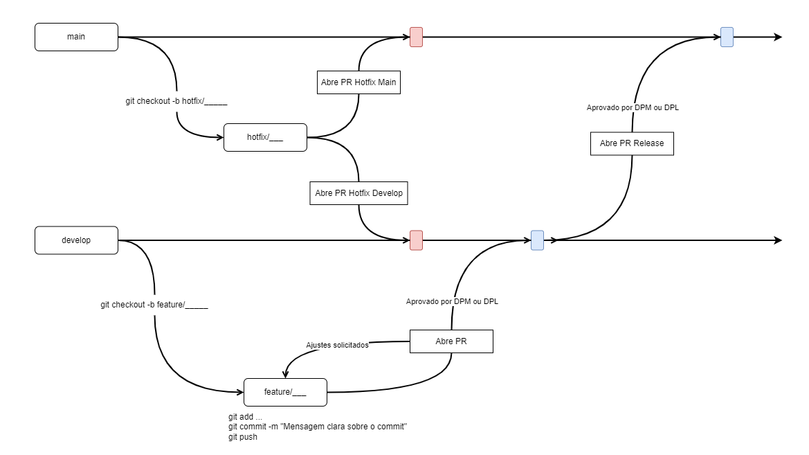

# Modelo de dbt para o Projeto da Adventure Works (Português)

Este repo apresenta a estrutura de ELT utilizada no projeto de implementação de infraestrutura de analytics na **Indicium**. Os dados são extraídos de diversas fontes de dados, como Bitrix, Planilhas, Redes Sociais... e armazenados no **Amazon S3**. Uma vez executada esta etapa, os dados são inseridos no **Snowflake** onde, efetivamente, começam as etapas de transformação dos dados utilizando-se o dbt. O pipeline é orquestrado pelo **Airflow**.

## Iniciando

Neste projeto **não é necessário** estar conectado a uma VPN para a realização da transformação dos dados, mas **é necessária** a VPN para utilizar a ferramenta de orquestração do pipeline (**Airflow**). No entanto, é preciso ter acesso ao repositório do projeto, ao **Snowflake**:

Conta: **INDICIUMTECH**
Database: **SANDBOX** (Você precisa solicitar a criação de um ambiente de desenvolvimento pessoal dev_nome_sobrenome).

E, se necessário, necessitará de acesso à roles específicas para sua atividade na plataforma. Falaremos melhor disso.

### Clonando o projeto

Primeiramente, é necessário clonar o repo localmente. Você deve fazer isso acessando o repo do projeto no **bitbucket**. O projeto pode ser clonado via SSH ou HTTPS utilizando-se o comando `git clone` no link. **E.g.:**

- `git clone git@bitbucket.org:indiciumtech/dbt_indicium.git`

### Criando um virtual environment

É preciso criar um [ambiente virtual](https://pythonacademy.com.br/blog/python-e-virtualenv-como-programar-em-ambientes-virtuais) na pasta home do projeto (caso você ainda não o tenha feito).

- `python3 -m venv venv` ou

- `py -3.8 -m venv venv` para Bash no Windows. 

Caso você também tenha instalada uma versão posterior ao python 3.8 (o python 3.9, por exemplo, ainda contém bugs para rodar o dbt), **prefira usar a versão 3.8**. A **versão do Python** utilizada neste projeto é a **3.8.10**.

Além disso, o **virtual environment deve ser ativado toda vez que você abrir o projeto** através do comando:

- `source venv/bin/activate` no Linux ou

- `source venv/Scripts/activate` em bash no Windows, ou ainda

- `.\venv\Scripts\activate.ps1` no Windows PowerShell

Garanta que você está na pasta onde o ambiente virtual foi criado. Se ele for ativado corretamente, o terminal terá uma flag apontando ***(venv)*** na frente do nome do usuário antes de cada comando. Para desativar o ambiente virtual, basta rodar: 

- `deactivate`.

### Instalando as bibliotecas do projeto

O próximo passo é instalar as bibliotecas listadas no arquivo **requirements.txt**. Isso pode ser executado através do [pip](https://pypi.org/project/pip/):

- `pip install -r requirements.txt` ou

- `python -m pip install -r requirements.txt` para alguns casos em que o comando anterior não funciona.

Para conferir se todas as bibliotecas foram instaladas corretamente, utilize `pip list` e valide as bibliotecas e suas respectivas versões listadas.

### Configurando o *profiles.yml*

O projeto já vem com o profiles configurado na pasta base do repositório, puxando as credenciais de variáveis ambiente definidas pelo usuário. 

Como boa prática, será necessário criar um arquivo .env (dotenv) dentro do seu ambiente do projeto, seguindo o modelo do arquivo `.env.example`. Para isso, basta copiar o arquivo e colar no mesmo local, renomeando de `.env` e preencher as informações de host, schema, usuário, senha e o que mais for necessário.

**Atenção:** Com isso não será necessário configurar o arquivo `profiles.yml` na pasta `.dbt` do seu computador.

Para desenvolvimento local, bastam as informações 

```python
export DBT_SF_DB_ACCOUNT="dkb35813.us-east-1"
export DBT_SF_DEV_USER="<your_snowflake_user>"
export DBT_SF_DEV_PASSWORD="<your_skowflake_password>"
export DBT_SF_DEV_ROLE="<your_principal_work_role>"
export DBT_SF_DEV_DATABASE="sandbox" # Nós sempre iremos trabalhar/escrever coisas no Sandbox 
export DBT_SF_DEV_WAREHOUSE="<Warehouse designado para a função que está executando>"
export DBT_DEV_SCHEMA="<Schema pessoal criado no sandbox>"
``` 

Após isso, rode o comando `source .env` no terminal (lembre-se de entar com a venv ativada)
Para testar se está funcionando, você pode rodar `echo $DBT_SF_DB_ACCOUNT` no terminal. Se retornar o valor que foi configurado, sua variável de ambiente está ativa.

Se você ainda não possui suas credenciais, solicite-as à/ao **Tech Lead do Projeto**.

***Preste atenção para não editar o arquivo profiles.yml do repo remoto do projeto.***

*****************

### Atualizando o projeto na branch de desenvolvimento

Ainda, antes de rodar o dbt, é interessante que o seu **repo local esteja atualizado com a branch de desenvolvimento.** Quando o repo remoto é clonado, o git automaticamente clona a branch principal do projeto (*master/main*). Para que o projeto fique **atualizado com a branch *develop***, basta rodar um `git pull`:

- `git pull origin develop`

Este processo é padrão para todos os projetos da Indicium. Mais adiante há uma seção que explica brevemente como funciona o versionamento e suas boas práticas.

## Rodando o dbt

Após clonar o repo remoto com sucesso, é recomendado executar um teste para confirmar se o **profiles.yml** e o **dbt_project.yml** estão configurados e rodando corretamente, além de verificar novamente as dependências e as conexões necessárias.

Para isso, o comando a ser executado é:

- `dbt debug`

Garantido que todas as configurações estejam funcionando corretamente, é possível iniciar o carregamento e a transformação dos dados.

As etapas de carregamento e transformação são endereçadas ao ***CGP/AWS/etc***. Cada membro do projeto possui um schema próprio dedicado, que deverá ser utilizado para seu desenvolvimento.

Para instalar os pacotes descritos no arquivo *packages.yml*, pode-se rodar:

- `dbt deps`

### Modelos:

O processo para rodar os modelos pode ser feito de diversas maneiras, seja de forma modular (um modelo específico de cada vez), de forma a rodar todos os modelos de uma única vez, ou ainda de outras formas. Abaixo estão descritos os códigos para cada comando:

*O comando abaixo roda todos os modelos de uma única vez:*

- `dbt run --full-refresh` 

***Evite esse comando se já souber onde vai trabalhar, uma vez que ele consome muito recurso.***

*Para rodar apenas o modelo especificado:*

- `dbt run -s modelo_que_quer_rodar`

*Para rodar o modelo especificado e todos os modelos dos quais esse modelo depende para ser gerado:*

- `dbt run -s +modelo_que_quer_rodar`

*Para rodar o modelo especificado e todos os modelos que são impactados por ele:*

- `dbt run -s modelo_que_quer_rodar+`

*Para rodar apenas modelos em uma pasta específica:*

- `dbt run -s pasta.*`


### Testes

Os testes são modelados para garantir a qualidade dos dados. Para rodá-los, basta:

- `dbt test`

***Todos os métodos de seleção de modelos apresentados no run valem para outras funções do dbt também.***

O **dbt test** roda todos os testes nos dados de modelos criados. Existem **dois tipos de testes:**

- Validação de schemas, inseridos no arquivo **schema.yml*;
- Teste de dados escritos em SQL.

O dbt test roda os dois tipos de testes e apresenta os resultados no console.

Quando você fizer alterações nos scripts do dbt, por favor **siga as diretrizes de estilo de código e convenções do dbt e, também, garanta que os modelos estão rodando corretamente e que todos os testes passaram.** 


***Caso você queira rodar e testar ao mesmo tempo (indicado no ambiente de desenvolvimento), você pode utilizar o comando build.***

- `dbt build`

### Documentação no dbt

Uma boa documentação para os modelos de dbt nos ajuda a gerir e entender os conjuntos de dados envolvidos no projeto.

O projeto está organizado da sequinte forma: 
*(Clique para expandir)*

<!-- macros starts here -->
**<details><summary>macros</summary><p>**<blockquote>

 _Contém funções essenciais ou úteis para o bom funcionamento do projeto._

__<details><summary>essential_functions</summary><p>__<blockquote>

_Contém funções essenciais para o bom funcionamento do projeto, como funções de escrita de modelos em produções, funções que envolvem pipeline de CI, entre outras._ 

- **essential_functions.yml**: _Contém a documentação das funções customizadas salvas na pasta._

</p></blockquote></details> 

__<details><summary>support_functions</summary><p>__<blockquote>
_Contém funções customizadas que dão suporte às transformações._
- **support_functions.yml**: _Contém a documentação das funções customizadas salvas na pasta._

</p></blockquote></details> 

</p></blockquote></details> 

<!-- models starts here -->
**<details><summary>models</summary><p>**<blockquote>

 _Os modelos estão organizados por área de negócio e as pastas devem seguir o nome dos databases de cada área que estão no Snowflake. Temos até o momento:_


<!----------------- Commercial models starts here -->
__<details><summary>commercial</summary><p>__<blockquote>

</p></blockquote></details> 


<!----------------- Marketing models starts here -->
__<details><summary>marketing</summary><p>__<blockquote>

</p></blockquote></details> 

<!----------------- People models starts here -->
__<details><summary>people</summary><p>__<blockquote>

</p></blockquote></details> 

<!----------------- Projects models starts here -->
__<details><summary>projects</summary><p>__<blockquote>

</p></blockquote></details> 


Os dados sobre cada coluna devem ser documentados nos diferentes arquivos **schemas.yml** para as diferentes camadas de processamento e transformação de dados:
- Staging;
- Intermediate;
- Marts.

</p></blockquote></details> 

<!-- seeds starts here -->
**<details><summary>seeds</summary><p>**<blockquote>

 _Os arquivos contidos aqui são materializados no banco como tabela toda vez que o modelo roda. Importante cuidar para não incluir dados sensíveis nessa pasta. Os arquivos são organizados por área de negócio, assim como os modelos, como uma forma de definir o owner do arquivo, caso venha a dar problema._

</p></blockquote></details> 

<!-- snapshots starts here -->
**<details><summary>snapshots</summary><p>**<blockquote>

 _Nessa pasta estão os modelos que geram os snapshots dos dados que precisamos monitorar as modificações ao longo do tempo. Os arquivos são organizados por área de negócio, assim como os modelos, como uma forma de definir o owner do arquivo, caso venha a dar problema.._

</p></blockquote></details> 

<!-- tests starts here -->
**<details><summary>tests</summary><p>**<blockquote>

 _Nessa pasta estão os testes de dados feitos para garantir que os dados que o modelo está trazendo são condizentes com o valor esperado. Os arquivos são organizados por área de negócio, assim como os modelos testados, para ajudar na localização dos mesmos._

</p></blockquote></details> 

<br><br>
### Seleção de Databases:
Um detalhe importante a se atentar, é que como estamos trabalhando com databases diferentes, é necessário algumas configurações adicionais para sempre referenciarmos o database que precisamos para determinado modelo ou teste. Por exemplo, na camada statging da seção models, configuramos o yml dessa forma:

```python
version: 2
sources:
  - name: identificação_da_source
    database: database_dos_dados_raw
    description: descrição dos dados que compõem o database
    schema: schema_dos_dados_raw
    tables:
      - name: nome_da_tabela_raw
        description: descrição da tabela raw
        columns: 
          - name: nome_da_coluna 
            description: descrição dos dados da coluna
```

Segue-se essa estrutura para cada nova coluna/tabela/schema, cada um seguindo sua identação. Nesse caso, se o database não for identificado, na hora de rodar, o dbt vai tentar localizar o schema com os dados raw dentro do database definido no profiles, e se não localizar (principalmente se tratando do desenvolvimento no sandbox do snowflake), irá retornar um erro.


### Gerando o dbt docs

O dbt fornece uma maneira simples de gerar documentação para o projeto e renderizá-lo como um site, o **dbt docs**.

Dentro da pasta do projeto, há um arquivo **packages.yml**. Neste aquivo colocamos os pacotes e as versões das dependências do dbt utilizadas no projeto. O comando para instalar estas dependências é:

- `dbt deps`

É importante ressaltar que, caso isso não tenha sido feito ainda, deve-se fazê-lo antes das próximas etapas. Dar um `dbt run` antes de ter dado um `dbt deps` **vai falhar.**

Feito isso, para gerar a documentação, deve-se utilizar o comando:

- `dbt docs generate` 

Esse comando vai gerar uma pasta **target**. Essa pasta em si vira a documentação. Para visualizar o **dbt Docs**, ou seja, interpretar a pasta target, deve-se usar:

- `dbt docs serve` - que hospeda um servidor local e monta a documentação.

Essa documentação do dbt docs serve **é muito completa e muito útil para entender como está organizado o modelo e como as tabelas se relacionam.** Isso é importante tanto para a gestão do projeto por parte dos atuais membros, quanto para a gestão do conhecimento pensando em futuros novos membros ou em escalabilidade de outros projetos.

## Controle de versão

O versionamento é feito com **git**. O projeto segue o fluxo de trabalho do [gitflow](https://danielkummer.github.io/git-flow-cheatsheet/index.pt_BR.html). Este é composto principalmente por uma *branch master/main*, que é onde os arquivos criados estão disponíveis para produção, e uma *branch develop*, que agrega as mudanças recentes feitas no código. Novas funcionalidades ou mudanças devem ser desenvolvidas em *branches* com o seguinte padrão:

- `git checkout -b feature/nome_da_nova_branch`

Este comando cria uma nova branch chamada "feature/nome_da_nova_branch". **Prefira commits pequenos com mensagens claras sobre quais foram as alterações feitas em cada commit.**

Uma prática muito importante é de sempre buscar sair da branch que você se encontra, voltar para a *develop*, para assim então poder criar uma nova branch. Isso evita fazer alterações em cima de outras alterações que ainda nem sequer foram aprovadas para desenvolvimento. Para isso:

- `git checkout develop`
- `git checkout -b feature/nome_da_nova_branch`

Após a **feature ser finalizada, completamente testada e com as alterações salvas no repo**, crie um PR (*Pull Request*) para a branch deveplop usando o template de PR's, adicione o link do PR como um comentário na respectiva Task do Projeto no Bitrix e o compartilhe com os membros do Projeto.

Uma vez o PR aprovado, as alterações serão mescladas na branch *develop*, onde serão testadas junto com as outras etapas do projeto que forem executadas em paralelo. Só então as alterações serão mescladas e enviadas para produção. Além disso, quanto antes as alterações forem mescladas na *develop*, a branch na qual o PR foi criado pode ser fechada no Bitbucket.  **Por favor confira a Wiki para entender como funciona o fluxo de trabalho completo!** [Wiki link](https://wiki.indicium.tech/en/analytics-engineering/processo-trabalho).

Para entender mais profundamente o processo de acúmulo de diferentes branches para diferentes features, leia mais sobre o fluxo de trabalho com o [gitflow](https://www.atlassian.com/br/git/tutorials/comparing-workflows/gitflow-workflow). Uma vez que as _features_ estão mescladas na branch _master_, essas branches de desenvolvimento podem ser apagadas localmente com: 

- `git branch -d <branch>`

Leitura adicional: [CI/CD](https://www.redhat.com/pt-br/topics/devops/what-is-ci-cd)

## Processo de trabalho

No projeto seguiremos as boas práticas adotadas pela Indicium.

Abaixo temos um exemplo de como funcionará o fluco de trabalho no projeto Indicium DSaaS.



**PR Release**
- Necessário conter atualização da versão do projeto (idealmente feita pelo CI)
- Atualização das atualizações chaves no documento `CHANGELOG.md`.

**PR Hotfix**
- Deve-se evitar esse tipo de PR. Utilizar apenas em correções críticas.
- Deve ser tratado com prioridade máxima. **Cabe ao analista ir atrás da aprovação do mesmo.**
- Quando isso for necessário, deverão ser feitos dois PRs, um para a main e um da mesma branch para a develop. O foco inicial é a aprovação para a main, para corrigir o problema identificado.
- Idealmente esse PR será aberto e mergeado tanto na main quanto na develop no mesmo dia
- Incluir no `CHANGELOG.md` uma descrição do que foi corrigido.

Para mais informações sobre desenvolvimento git olhar a documentação na [Wiki](https://wiki.indicium.tech/en/processos/CoE/git)
